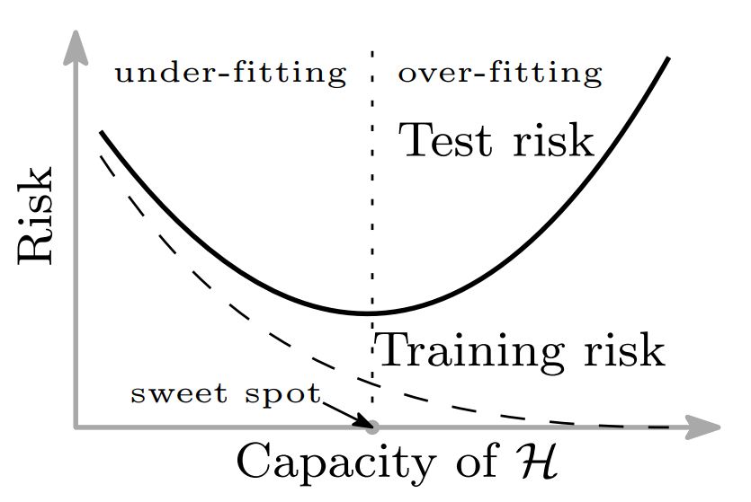
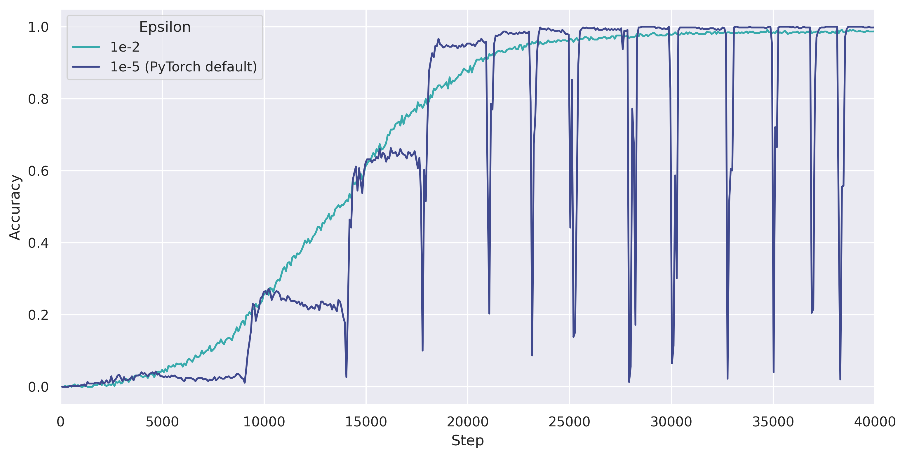

# Weight Decay and Its Peculiar Effects

> How does it work, why does it work, and some practical tips.


### What is weight decay?

Weight decay, sometimes referred to as L2 normalization (though they are 
not exactly the same, [here is good blog post explaining the differences](https://towardsdatascience.com/weight-decay-l2-regularization-90a9e17713cd)), 
is a common way to regularize neural networks. It helps the neural networks
to learn smoother / simpler functions which most of the time generalizes 
better compared to spiky, noisy ones. 

There are many regularizers, weight decay is one of them, 
and it does it job by pushing (decaying) the weights towards 
zero by some small factor at each step.

In code, this is implemented as 

```python
# run on every step
parameters *= (1 - learning_rate * weight_decay)
... # update parameters normally
```

where `weight_decay` is a hyperparameter with 
typical values ranging from `1e-5` to `1`.

In practice, you do not have to perform this update yourself. 
For example, optimizers in PyTorch have a `weight_decay` 
parameter that handles all the updates for you.

```python
import torch.optim

optimizer = torch.optim.Adam(params, lr=3e-4, weight_decay=1e-3)
```


### Intuition of weight decay

But how does weight decay actually help the model? Under what circumstances
should we use it?

First, we have to understand why models fail to generalize. 

#### Classical regime

In classical machine learning theory, we believe that there exists 
an "under-fitting" and an "over-fitting" region. 



In the under-fitting region, the model is "too simple" to 
capture the structure of the data and so there will both **high train error** 
and **high test error**. 

In the over-fitting region, the 
model has enough capacity where it can just memorize the training 
dataset without learning the underlying structure of the data, leading 
to **low train error** but **high test error**. 

In either case, the 
model fails to generalize. The classical wisdom is that the best 
models lie between these two regions. A typical example is shown 
above.

Weight decay here acts as a method to **lower the model's capacity** 
such that an over-fitting model does not overfit as much and gets 
pushed towards the sweet spot. 
This also shows that weight decay will have a negative impact if the 
model is originally operating in the under-fitting region.

#### Modern regime

However, very recent research reveals a phenomenon called
"Deep Double Descent" to show that there actually exists a **third** region.
While classical theory says that further increasing model complexity 
results in higher test error, empirical evidence suggests that test error 
will drop as we go beyond the "over-fitting" region into the 
"over-parameterized" region. 


Empirical evidence shows that such boundary (called the "interpolation threshold")
between the over-fitting and over-parameterized regions
 occurs when the model just barely has enough capacity to 
 achieve **(near-)zero training loss**.

At the interpolation threshold, there is **only one** set of parameters that 
can interpolate the entire training set. It is 
most likely the case that such particular interpolation will be 
quite bumpy and spiky because most datasets involve some degree of noise. 
When the model is forced to fit on all the noise with just barely enough 
capacity, it does not have additional room to make the function 
smooth outside the noisy training points, and so generalizes poorly. 

As we further increase the 
model capacity, not only can it perfectly hit the training 
data points, it also gets the additional capacity to choose functions 
that smoothly interpolate between the space in between, 
and thus generalize better. 

This is the part where weight decay comes in. 

Out of all the possible interpolations that the model can learn, 
we want to bias our model towards the smoother, simpler ones such that 
it is able to generalize. And weight decay does exactly that. This is why 
weight decay is so powerful.

Though not totally accurate, I think the following meme sums up our 
current understanding quite well.


### Toy experiment

To test the above properties, I trained a simple feed-forward network 
with skip connections to learn to perform addition on binary-encoded 
numbers. For example,

```python
# Example
inputs = (
    [0, 0, 0, 0, 0, 0, 0, 0, 0, 1, 0, 1, 1, 0, 0, 1],  # 89
    [0, 0, 0, 0, 0, 0, 0, 0, 0, 0, 0, 0, 1, 0, 1, 1]   # 11
)
label = [0, 0, 0, 0, 0, 0, 0, 0, 0, 1, 1, 0, 0, 1, 0, 0]    # 100
```

It is trained on 2 and 4 digit addition and tested on 3 digit addition 
to measure its generalization ability.

Here is a plot of train and test accuracy against weight decay factor:


We can see that for this model, suitable values of λ is around 0.1. 

On the left-hand side, where λ is too low, the model totally has enough 
capacity to fit the training dataset but is not biased towards finding 
simpler interpolations, so the test accuracy is very low.

On the right-hand side, where λ is too high, the model gets restricted 
too much by being forced to use very small weights so that it is not 
expressive enough to even fit the training data. Thus, both the 
train and test accuracies are low.

According to our intuition above, we expect to see a 
dip in test accuracy at the interpolation threshold -- but we don't. Why?

My best guess is because our dataset is totally noise-free and so that 
particular set of weights at the interpolation threshold does not get 
messed up and ends up generalizing well. 

Just to further illustrate how important weight decay is in helping the 
model generalize, here are the training curves for the model with 
λ = 0.1:


In the first 3665 steps, the model is able to achieve 100% accuracy 
with almost zero training loss. However, the test accuracy is still 
very low. 

Over the course of the next 25K steps, it continues to minimize the 
weight norm (the sum of the squared model weights) while keeping 
a perfect train accuracy. This corresponds to finding to simpler 
interpolation for the training data, and we can clearly see 
a correlation between that and the increase in 
test accuracy.

Simpler interpolations = profit!

### Picking the right value

In general, there is no golden rule to picking the value of 
weight decay. Some trial and error is unavoidable. However, 
there are some rules that you can follow. Researches proposing 
the AdamW optimizer has suggested the following rule:

<!-- $$
\lambda = \lambda_{norm}\sqrt{\frac{b}{BT}}
$$ --> 

<div align="center"></div>


where `b` the batch size, `B` is the total number of training points, 
and `T` is the total number of epochs. Now the hyperparameter 
to tune is `λ_norm`. 

So they just replaced a hyperparameter with another hyperparameter...  
Hmm... How is this useful??

Well, it helps because the decouples the choices of `b`, `B` and `T` 
from the suitable weight decay value so it makes it easier to 
tune hyperparameters. 

Though, you would still need search for good values of `λ_norm`. 
The authors found `λ_norm` in the range of 0.025 to 0.05 to 
be optimal for their networks trained on image classification. 
Maybe this can act as a useful starting point.

### Problems with batch normalization

Nowadays we almost always put batch norm layers into our 
neural networks because it speeds up the training a lot. 
However, while I'm running my experiments, I often see this 
weird behavior of periodic fluctuations when I use
batch norm layers with weight decay.

It is certainly not the first time that I've seen this 
behavior. It seems like these fluctuations starts to 
appear when 
the model is about to converge. So what is causing it?

I turned to Google for answers and came across this paper: 
[On the Periodic Behavior of Neural Network Training with Batch Normalization and Weight Decay](https://arxiv.org/abs/2106.15739). 
In summary, it has to do with how batch norm layers work. 

<!-- $$
y = \frac{x-\text{E}[x]}{\sqrt{\text{Var}[x]+\epsilon}} * \gamma + \beta
$$ --> 

<div align="center"></div>


The above shows 
the formula for how batch norm computes its outputs. Here, `x` is 
a feature with dimensions `(batch_size, 1)`. Crucially, 
it divides the values by the square root of the sum of 
the variance of `x` and some small value epsilon.

When we use weight decay, some weights gradually get 
pushed to zero. As the weight approaches zero, the value of that feature 
in a particular layer will also approach zero (or a constant value) no 
matter what inputs it gets from the previous layer. 
As a result, the variance of these values across the batch 
becomes tiny such that when we pass that it to 
the batch norm layer, it divides it by a near-zero value, causing the 
final output to blow up. This causes the huge fluctuations as we see 
from the graph below.



After it blows up, the weight gets updated to some large value 
due to the huge gradient at that step, so the variance becomes 
high again. Again, the weight will start to decay, and the process 
repeats itself creating the periodic pattern.

In a practical point of view, to avoid 
such instabilities, I found that simply increasing the value of epsilon 
to something larger (like `1e-2` instead of the PyTorch default of 
`1e-5`) works surprisingly well.

Just another useful thing to keep at the back of your head.

### Summary

Weight decay is a regularization method to make models generalize 
better by learning smoother functions. In the classical 
(under-parameterized) regime, it helps to restrict models from 
over-fitting, while in the over-parameterized regime, it helps 
to guide models towards simpler interpolations. In practice, 
there is a sweet spot where a particular weight decay 
value works the best. Sometimes, it can cause unwanted side effects 
such as period fluctuations due to how it interacts with 
batch normalization layers.

In any case, weight decay is a very power tool to help models 
generalize.

### References

1. Preetum Nakkiran, Gal Kaplun, Yamini Bansal, Tristan Yang, Boaz Barak, Ilya Sutskever. 
   [Deep Double Descent: Where Bigger Models and More Data 
   Hurt](https://arxiv.org/abs/1912.02292). 2019. arXiv:1912.02292
2. Mikhail Belkin, Daniel Hsu, Siyuan Ma, Soumik Mandal. 
   [Reconciling modern machine learning practice and the 
   bias-variance trade-off](https://arxiv.org/abs/1812.11118). 2019. 
   arVix:1812.11118
3. Ekaterina Lobacheva, Maxim Kodryan, Nadezhda Chirkova, Andrey Malinin, Dmitry Vetrov. 
   [On the Periodic Behavior of Neural Network Training with 
   Batch Normalization and Weight Decay](https://arxiv.org/abs/2106.15739). 2021. 
   arVix:2106.15739
4. Ilya Loshchilov, Frank Hutter.
   [Decoupled Weight Decay Regularization](https://arxiv.org/abs/1711.05101). 2019. 
   arVix:1711.05101
